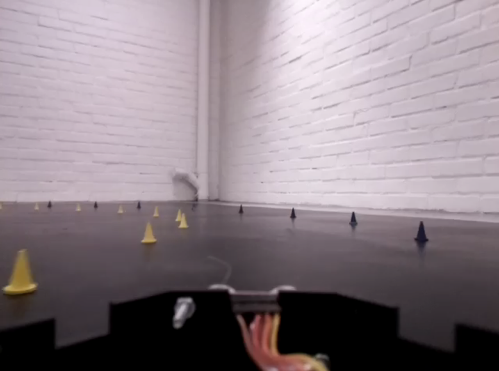

<!-- ~/README.md -->
<div align="center">

### Cyber-Physical Systems, System of Systems -- Group 9

<!-- Badges -->
[![Pipeline status][pipeline-status]][pipeline-status]
[![Coverage report][coverage-badge]][coverage-url]
[![Latest Release][release-badge]][release-url]

</div>

<!-- LINKS (badges) -->
[pipeline-status]: https://git.chalmers.se/courses/dit638/students/2024-group-09/badges/main/pipeline.svg
[coverage-url]: https://git.chalmers.se/courses/dit638/students/2024-group-09/-/commits/main
[coverage-badge]: https://git.chalmers.se/courses/dit638/students/2024-group-09/badges/main/coverage.svg
[release-url]: https://git.chalmers.se/courses/dit638/students/2024-group-09/-/releases
[release-badge]: https://git.chalmers.se/courses/dit638/students/2024-group-09/-/badges/release.svg

## Table of Contents

- [Introduction](#introduction)
- [Prerequisites](#prerequisites)
- [Installation](#installation)
- [Usage](#usage)
- [Local Development](#local-development)
- [Workflow](#workflow)
- [Development team](#development-team)



This project develops a data-driven algorithm to determine the steering angle
of a mini self-driving vehicle. The algorithm uses data from multiple sensors
and outputs a ground steering request to determine the future course of the
car. The project is designed to run in a `Docker` environment, making it
compatible with devices like a `Raspberry Pi`.

Our approach uses a **Random Forest Regressor** learning model based on 13
features: Angular Velocity X-, Y- and Z-axis, Acceleration X-, Y- and Z-axis,
Magnetic Field X-, Y- and Z-axis, Heading, Pedal, Voltage and Distance. The
model was trained on 5 recording (i.e. `.rec`) files. 

## Prerequisites
- [`git`][git]
- [`Docker`][docker]
- [`Python`][python] (for local development)
- A **web browser** (preferably Chrome or Firefox)

<!-- LINKS -->
[git]: https://git-scm.com/downloads
[docker]: https://docs.docker.com/get-docker/
[python]: https://www.python.org/downloads/

## Installation

These instructions are tailored for Unix-based systems, potentially compatible
with most Linux/OSX distributions. Tested on Ubuntu 22.04, the recommended
environment for the project.

Initially, you have to `pull` the image:

```sh
# Or select any preferred version. Stable releases v1.0.0+.
docker pull registry.git.chalmers.se/courses/dit638/students/2024-group-09:v1.0.1
```

In these instructions, we refer to the image as `read_car_data:latest` (similarly
in the scripts). You can *"rename"* the image to `read_car_data:latest` by using
`docker tag`, namely:

```sh
docker tag registry.git.chalmers.se/courses/dit638/students/2024-group-09:v1.0.1 read_car_data:latest
```

Our program is combined with two other microservices, each responsible for a
specific task. The microservices are:

- [`OpenDLV-Vehicle-View`][opendlv-vehicle-view]
- [`OpenDLV-Video-H264-Decoder`][opendlv-video-h264-decoder]

<!-- LINKS -->
[opendlv-vehicle-view]: https://github.com/chalmers-revere/opendlv-vehicle-view
[opendlv-video-h264-decoder]: https://github.com/chalmers-revere/opendlv-video-h264-decoder

Ensure that you have the required microservices installed and running.
You can use the following **shell scripts** to start the microservices:

```sh
# 1.) Start OpenDLV-Vehicle-View
./scripts/init_opendlv.sh
# or
docker run --rm -i --init --net=host --name=opendlv-vehicle-view \
           -v $PWD:/opt/vehicle-view/recordings \
           -v /var/run/docker.sock:/var/run/docker.sock \
           -p 8081:8081 chrberger/opendlv-vehicle-view:v0.0.64

# 2.) Start OpenDLV-Video-H264-Decoder
./scripts/init_h264-decoder.sh
# or
docker run --rm -ti --net=host --ipc=host -e DISPLAY=$DISPLAY \
                    -v /tmp:/tmp h264decoder:v0.0.5 --cid=253 --name=img
```

Having installed the image, you can use a **shell script** to run it:
```sh
# Default command-line arguments
./scripts/run.sh

# The script contains:
docker run --rm -ti --net=host --ipc=host -e DISPLAY=$DISPLAY \
           -u=$(id -u $USER):$(id -g $USER) \
           -v /tmp/.X11-unix:/tmp/.X11-unix:rw \
           -v /tmp:/tmp read_car_data:latest $@
```

If you prefer to **build** the image locally, you can use this script instead
(this will target the host machine's architecture, which may be useful):
```sh
./scripts/build.sh
# or
docker build --rm -f Dockerfile -t read_car_data .
```

Afterwards, navigate to your browser and open `localhost` (or it's equivalent)
with the port `8081` and select a `.rec` file to instantiate the vehicle view.

### Obtain the `.rec` files

The `.rec` files are not provided in the repository to reduce its size. You can
call the following script that will **fetch** all the files to your current
directory (note: the script relies on the [`wget`][wget-link] command-line utility):

```sh
./scripts/fetch_rec.sh

# Use the `--all`, `-a` flag to receive .rec files with no GSR trace too
./scripts/fetch_rec.sh --all
```

Otherwise, you can download the files manually from [here][alternative-rec-source].

[wget-link]: https://www.gnu.org/software/wget/
[alternative-rec-source]: https://github.com/michalspano/dit639-proj-rec-dump

Please consult the [**Chalmers ReVeRe**](https://github.com/chalmers-revere)
GitHub repositories for more information in terms of the microservices.

### Usage, Supported Flags

Here's the list of the supported **command-line arguments** with a brief
description (see [Modes, Debugging, Testing](#supported-modes-debugging-and-testing)
for more information):

```txt
# See the usage, type `--help` or `-h`
usage: app.py [-h] [--cid CID] [--name NAME] [--model MODEL] [--graph] [--verbose] [--dev-mode]

Calculate the steering angle from rec files with ML, based on the Chalmers ReVeRe Project.

optional arguments:
  -h, --help            show this help message and exit
  --cid CID, -c CID     CID of the OD4Session to send and receive messages
  --name NAME, -n NAME  name of the shared memory area to attach
  --model MODEL, -m MODEL
                        select a joblib based model to predict the steering angle; acquired from ./models/<NAME>
  --graph, -g           generate a graph
  --verbose, -v         enable debug window and additional metrics
  --dev-mode, -d-m      calculate and show accuracy on only turns
```

## Local Development

You're similarly encouraged to locally engage with the system. You may start
cloning repository:

```sh
git clone git@git.chalmers.se:courses/dit638/students/2024-group-09.git
# TODO: add GiHub mirror (after the project is over)
```

### Getting Started

It is preferred to create a `python`-based virtual environment, hence:
```sh
# 1.) From the root
python3 -m venv venv

# 2.) Activate the venv
source ./venv/bin/activate

# 3.) Install the dependencies inside venv
pip3 install -r requirements.txt

# 4.) Naviagate to the source directory
cd src

# 5.) Run the program
./app.py
# or python3 app.py

# 6.) See program's usage
./app.py --help
```

### Supported Modes, Debugging, and Testing

There's some additional functionality that you can use:
Plotting the predicted ground steering request and actual ground steering request:

```sh
# 1.) Run the application with `--graph` flag
./app.py --graph
# ./app.py -g
# This will create a log file with the parameters in the `tmp` directory

# 2.) Compute a performance metric
# Generates a static PNG file with the performance metric in the current
# directory.
./src/tools/graph_generator/app.py
```

```sh
# 1.) Debug window:
# Run the application with `--verbose` flag
./app.py --verbose
# ./app.py -v
# This will pop up a window that displays relevant parameters for debugging.

# 2.) Development mode for debugging and testing:
# Run the application with `--dev-mode` flag
./app.py --dev-mode
# ./app.py --d-m

# On videos where the ground steering request is provided, this mode will
# calculate the accuracy of the algorithm on only turns (excluding parts where
# the ground steering request should be 0). It will log the accuracy of the
# algorithm.
```

Additionally, more related to the **development process**, you can use the
following:

```sh
# 1.) Run the tests
# Ensure that you're in the root of the project (with an activate `venv`) and type:
pytest

# 2.) Run the coverage report generation script
# Generate an HTML-based report (executed from the root)
./scripts/coverage.sh
# or
pytest --cov=src -cov-config=.coveragerc --cov-report=html:coverage_report

# Open the coverage_report folder in the current path
```

See [`src/README.md`](src/README.md) for more information on the source code
and the project structure.

# Workflow

Our team will use a `Gitlab`-based workflow (with `git` being a central part of
the workflow). Each **feature** will be contained in a separate issue created in
the project's repository hosted on `Gitlab`.

A member of the team (that the issue is assigned to) will be responsible for
the issue. A new *"feature"*-branch will be created for each feature. Once the
feature is completed, a merge request will be initialized and assigned a reviewer
from the team. The reviewer is responsible for (i) providing meaningful feedback on
the changes (ii) and ensuring that the changes are in line with the project
requirements.
Once a merge request is approved, the branch will be merged to the `main` branch.
The `main` branch must, at all times, contain a *"stable"* version of the product.
> When a stable version of the project is created, a tag in the form of `vX.Y.Z`
> will be created. The tag will be created by the team member responsible for
> the issue. The tag will be created after the merge request is approved and the
> branch is merged to the `main` branch. Note that `X`, `Y`, and `Z` are integers
> and represent the major, minor, and patch versions of the project, respectively.

In the case that the pipeline is failing, a merge to the `main` branch is not
allowed. In case that an unexpected behavior occurs on `main` branch, team
members create a new issue and resolve the problem.

## Commit Policy

Each commit message shall include the **number of the issue** and how the commit
is related to that issue. That is:

```sh
git commit -m "#<Issue number> <Commit message>" -m "<Commit description>"
```

## Development team

- @alesaf
- @arumeel
- @spano
- @omidk

---